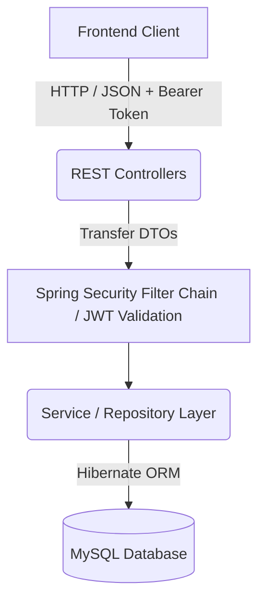

# StayNomadly — Backend ⚙️

The robust and secure backend ecosystem powering the StayNomadly platform. 

This repository contains the **Java Spring Boot** REST API, establishing a secure connection to a MySQL relational database to manage user authentication, property listings, and complex booking relationships.

## ✨ Key Features
- **Stateless Authentication:** Implements industry-standard JWT (JSON Web Tokens) with a custom Spring Security filter chain for secure endpoint lock-downs.
- **Relational Integrity:** Utilizes Hibernate / Spring Data JPA to automatically map Java Entity objects to MySQL SQL tables enforcing foreign-key configurations.
- **DTO Design Pattern:** Strictly separates database Entities from external Request/Response objects to protect internal database schemas from malicious payloads.
- **Automated Data Seeding:** Embedded `DataSeeder.java` script automatically injects real-world mock properties, locations, and multiple user roles upon database initialization.
- **Swagger UI Integration:** fully integrated `springdoc-openapi` module that generates a beautiful, interactive testing dashboard for the endpoints out of the box.

## 🏗️ Architecture



## 🚀 Quick Start

Ensure you have **Java 17+**, **Maven**, and a localized **MySQL** database server running.

1. **Configure MySQL:**
   Open `src/main/resources/application.properties` and ensure your database credentials correctly match your local machine.
   ```properties
   spring.datasource.url=jdbc:mysql://localhost:3306/staynomadly_db
   spring.datasource.username=root
   spring.datasource.password=your_password
   ```

2. **Run the Application:**
   Import the project as a Maven framework into an IDE (Eclipse / IntelliJ) and execute the `StayNomadlyApplication.java` file. It will spin up natively on `localhost:8086`.

3. **Explore the API:**
   Once running, you can test all endpoints natively by visiting the OpenAPI Swagger dashboard at:
   `http://localhost:8086/swagger-ui/index.html`
